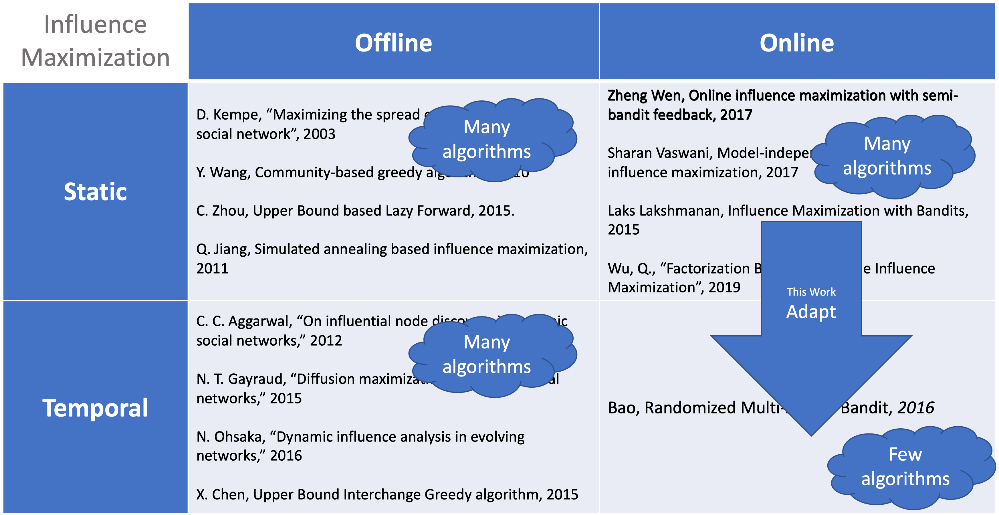
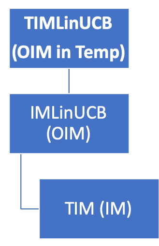
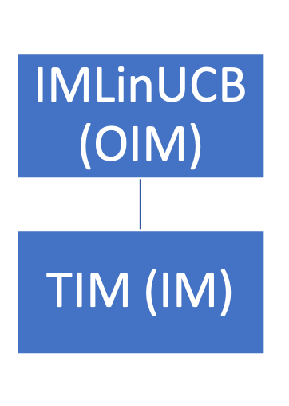

# TIMLinUCB

TIMLinUCB - an algorithm for Online Influence Maximization in Temporal Network.

## What?

## Why?

## TIMLinUCB

## IMLinUCB

## References

[[arXiv]](https://arxiv.org/abs/1605.06593)[IMLinUCB] Wen, Zheng, et al. "Online influence maximization under independent cascade model with semi-bandit feedback." Advances in neural information processing systems. 2017. 

[[arXiv]](https://arxiv.org/abs/1404.0900)[TIM] Tang, Youze, Xiaokui Xiao, and Yanchen Shi. "Influence maximization: Near-optimal time complexity meets practical efficiency." Proceedings of the 2014 ACM SIGMOD international conference on Management of data. 2014. 

[[arXiv]](https://arxiv.org/abs/1607.00653)[node2vec] Grover, Aditya, and Jure Leskovec. "node2vec: Scalable feature learning for networks." Proceedings of the 22nd ACM SIGKDD international conference on Knowledge discovery and data mining. 2016.

[[arXiv]](https://arxiv.org/abs/1604.07638)[RSB] Bao, Yixin, et al. "Online influence maximization in non-stationary social networks." 2016 IEEE/ACM 24th International Symposium on Quality of Service (IWQoS). IEEE, 2016.
