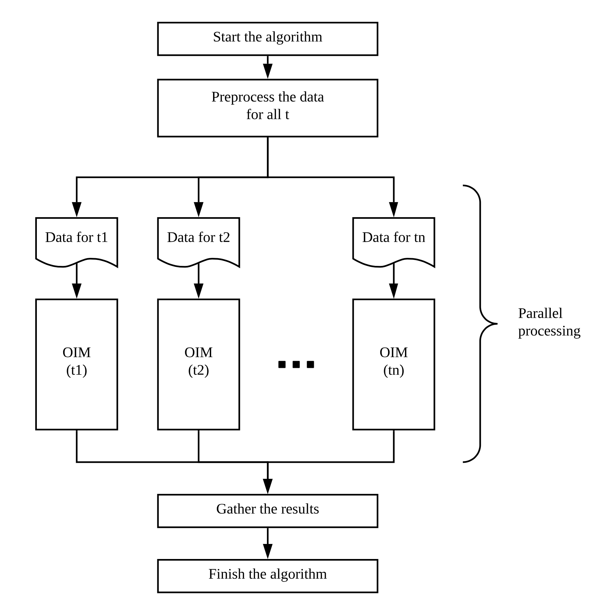

# TIMLinUCB - an algorithm for Online Influence Maximization in Temporal Networks.

## What?

An effective way of finding the most influential nodes in a temporal network without knowing everything about it (aka in an online way).

## Why?

The current (2020) Influence Maximization literature is mainly focused on analyzing static networks as well as temporal networks in cases where we know the "activation probability" of a node X transferring some information to the node Y. 

As you can see from the diagram above, the only algorithm designed specifically for the case of Online IM in Temporal Networks is RSB. This work aims to change this by introducing TIMLinUCB - a temporal adaptation of a state-of-the-art Online IM algorithm for Static networks.

## TIMLinUCB

TIMLinUCB is based on IMLinUCB (T stands for Temporal). 

While you can find the IMLinUCB paper in the references below, the basic algorithm is built on top of an efficient Offline IM algorithm, TIM. The main idea is similar to linear regression - IMLinUCB represents the edge activation probability of every edge as a vector of edge features multiplied by a weight vector (features are usually obtained using node2vec and multiplying the features of the two nodes that form the edge), and then adjusts the weight based on the output that TIM generates. If the influence generated by the TIM's output node set increases, we know that we are changing weights in a correct direction. Please check the referenced paper for a more mathematical description!

 
TIMLinUCB's structure (simplified)

TIMLinUCB extends IMLinUCB to work on temporal networks by simply applying the algorithm at every time step. The output of the algorithm is thus a set of sets, in which every subset is a seed that maximizes the influence at that time point. 

## Parallel Processing

Due to the TIMLinUCB's structure (It calls IMLinUCB for every time step while IMLinUCB calls TIM a certain number of times), it can be very time-consuming to run. But we can parellelize it! While IMLinUCB requires for its previous iteration to finish before the next one can begin, TIMLinUCB doesn't which leads us to the following parallelization scheme:

 
Parallelizing TIMLinUCB - Split by time step

At the same, we might want to run multiple TIMLinUCB sessions in parallel if we are looking for the best parameters of the algorihm:

 
Parallelizing TIMLinUCB - multiple TIMLinUCB instances

## Comparison with RSB

RSB by Bao, Yixin, et al. (referenced below) is also an algorithm designed to perform Online IM in Temporal Networks. While TIMLinUCB is based on an OIM algorithm, RSB was designed specifically for Temporal Networks, which makes it a good "sparring partner".

 
TIMLinUCB vs RSB: Efficacy (influence gathered), 100 seed nodes, FB dataset

You can see the comparison between TIMLinUCB and RSB in the pictures above and below. We used the Facebook dataset "fb-wosn-friends" and a seed set of 100 nodes.
As you can see, TIMLinUCB is better at actually finding the best seed node set but takes more time than RSB to execute, even if we are running the parallel version of TIMLinUCB. You can find more comparison charts in the [thesis introducing TIMLinUCB](https://github.com/olety/TIMLinUCB/blob/master/thesis/TIMLinUCB.pdf).

 
TIMLinUCB vs RSB: Execution time (seconds) against the number of seed nodes

## References

[[arXiv]](https://arxiv.org/abs/1605.06593)[IMLinUCB] Wen, Zheng, et al. "Online influence maximization under independent cascade model with semi-bandit feedback." Advances in neural information processing systems. 2017.

[[arXiv]](https://arxiv.org/abs/1404.0900)[TIM] Tang, Youze, Xiaokui Xiao, and Yanchen Shi. "Influence maximization: Near-optimal time complexity meets practical efficiency." Proceedings of the 2014 ACM SIGMOD international conference on Management of data. 2014.

[[arXiv]](https://arxiv.org/abs/1607.00653)[node2vec] Grover, Aditya, and Jure Leskovec. "node2vec: Scalable feature learning for networks." Proceedings of the 22nd ACM SIGKDD international conference on Knowledge discovery and data mining. 2016.

[[arXiv]](https://arxiv.org/abs/1604.07638)[RSB] Bao, Yixin, et al. "Online influence maximization in non-stationary social networks." 2016 IEEE/ACM 24th International Symposium on Quality of Service (IWQoS). IEEE, 2016.
